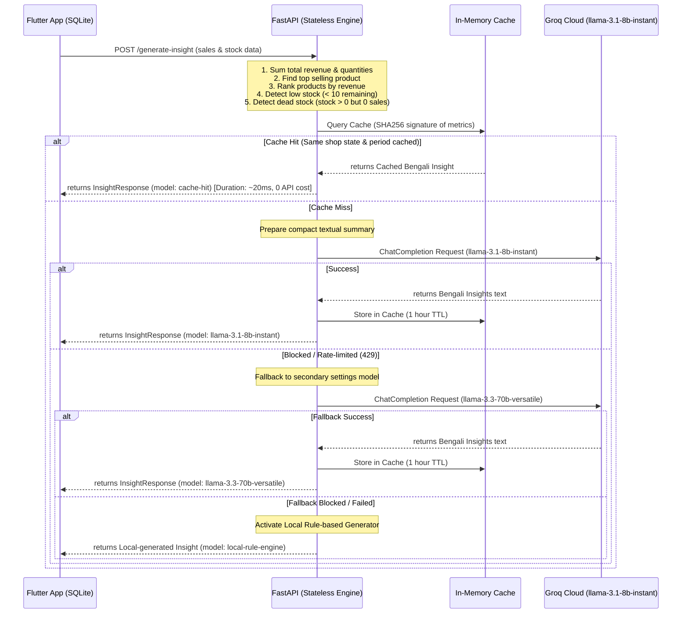

# AI-Powered Shop Insight System: Full Code Flow & Optimization Guide

This document provides a comprehensive walkthrough of the AI-Powered Shop Insight System backend. The system acts as a stateless, high-performance retail analytics engine that computes business metrics locally in Python and leverages Groq LLM to generate actionable business advice in Bengali.

---

## 🏗️ System Architecture & Data Flow

The backend is entirely stateless and does not utilize any database. To optimize for high user loads (5,000+ users) and strict API rate limits (RPM, TPM, RPD), we implement:
1. **In-Memory TTL Caching**: Hashes calculated metrics to prevent redundant Groq API queries.
2. **Compact Completion Targets**: System instructions restrict LLM responses to 120-150 words and output max-token constraints, saving substantial TPM (Tokens Per Minute).
3. **Double Fallback Recovery**: Automatically attempts to fallback to a secondary model and then to a high-quality local rule-based engine in case of quota denial or rate limits (HTTP 429).



---

## 🧮 Calculations Performed in Python
Before calling Groq, the following business metrics are computed directly in the API layer:

*   **Total Revenue**: Sum of all `revenue` fields in `sales`.
*   **Total Quantity Sold**: Sum of all `qty` fields in `sales`.
*   **Top Selling Product**: Product with the highest total quantity sold.
*   **Product Ranking by Revenue**: Sorting products based on revenue.
*   **Low Stock Detection**: Filtering products where `remaining < 10`.
*   **Dead Stock Detection**: Identifying products with remaining inventory (`remaining > 0`) but `0` sales recorded in the given period.

---

## 📂 Complete File Implementations

Here is the complete source code for each of the active components in the system:

### 1. Configurations: `app/core/config.py`
Loads settings from the `.env` file using Pydantic Settings.

```python
from typing import List
from pydantic_settings import BaseSettings, SettingsConfigDict


class Settings(BaseSettings):
    # FastAPI Application Settings
    PROJECT_NAME: str = "FastAPI Groq Base"
    DEBUG: bool = True
    API_V1_STR: str = "/api/v1"
    
    # Groq API Configuration
    GROQ_API_KEY: str
    GROQ_MODEL: str = "llama-3.3-70b-versatile"
    
    # CORS Configuration
    BACKEND_CORS_ORIGINS: List[str] = ["*"]

    # Configure Pydantic Settings behavior
    model_config = SettingsConfigDict(
        env_file=".env",
        env_file_encoding="utf-8",
        case_sensitive=True,
        extra="ignore"
    )


settings = Settings()
```

---

### 2. Request & Response Schemas: `app/schemas/insight.py`
Defines validation schemas using Pydantic V2.

```python
from typing import List
from pydantic import BaseModel, Field


class SalesItem(BaseModel):
    product: str = Field(..., description="Name of the product")
    qty: float = Field(..., description="Quantity of the product sold")
    revenue: float = Field(..., description="Total revenue generated by the product")


class StockItem(BaseModel):
    product: str = Field(..., description="Name of the product")
    remaining: float = Field(..., description="Remaining quantity in stock")


class InsightRequest(BaseModel):
    shop_name: str = Field(..., description="Name of the shop")
    period: str = Field(..., description="Sales and stock time period, e.g., 'last_30_days'")
    sales: List[SalesItem] = Field(..., description="List of products sold and their sales figures")
    stock: List[StockItem] = Field(..., description="List of products and their current stock levels")


class AnalyticsSummary(BaseModel):
    total_revenue: float = Field(..., description="Total revenue generated across all products")
    top_product: str = Field(..., description="Name of the top-selling product by quantity sold")
    low_stock: List[str] = Field(..., description="List of product names with stock level below 10 units")


class InsightResponse(BaseModel):
    success: bool = Field(..., description="Status of the API request")
    analytics: AnalyticsSummary = Field(..., description="Python-computed business analytics summary")
    ai_insight_bn: str = Field(..., description="AI-generated business insights in Bengali")
    model: str = Field(..., description="Name of the LLM model utilized for insights")
```

---

### 3. In-Memory Cache: `app/services/insight_cache.py`
Implements memory-based caching with TTL and FIFO size eviction.

```python
import time
import hashlib
import json
import logging
from typing import Dict, Any, Optional

logger = logging.getLogger(__name__)


class InsightCache:
    def __init__(self, ttl_seconds: int = 3600, max_size: int = 2000) -> None:
        self.ttl = ttl_seconds
        self.max_size = max_size
        self.cache: Dict[str, Dict[str, Any]] = {}

    def _hash_payload(self, shop_name: str, period: str, summary_dict: Dict[str, Any]) -> str:
        serialized = json.dumps({
            "shop_name": shop_name.strip().lower(),
            "period": period.strip().lower(),
            "summary": summary_dict
        }, sort_keys=True)
        return hashlib.sha256(serialized.encode("utf-8")).hexdigest()

    def get(self, shop_name: str, period: str, summary_dict: Dict[str, Any]) -> Optional[str]:
        cache_key = self._hash_payload(shop_name, period, summary_dict)
        if cache_key in self.cache:
            entry = self.cache[cache_key]
            if time.time() - entry["timestamp"] < self.ttl:
                logger.info(f"Cache hit for shop '{shop_name}'")
                return entry["value"]
            else:
                del self.cache[cache_key]
        return None

    def set(self, shop_name: str, period: str, summary_dict: Dict[str, Any], value: str) -> None:
        cache_key = self._hash_payload(shop_name, period, summary_dict)
        if len(self.cache) >= self.max_size:
            oldest_key = next(iter(self.cache))
            del self.cache[oldest_key]
            
        self.cache[cache_key] = {
            "value": value,
            "timestamp": time.time()
        }


insight_cache = InsightCache(ttl_seconds=3600, max_size=2000)
```

---

### 4. Groq Service Wrapper: `app/services/groq_client.py`
Encapsulates communication with Groq using `AsyncGroq`.

```python
from typing import List, Dict, Optional, Tuple, Any
from groq import AsyncGroq
import logging

from app.core.config import settings

logger = logging.getLogger(__name__)


class GroqService:
    def __init__(self) -> None:
        self.client = AsyncGroq(api_key=settings.GROQ_API_KEY, max_retries=5)
        self.model = settings.GROQ_MODEL

    async def generate_chat_completion(
        self,
        messages: List[Dict[str, str]],
        temperature: float = 0.7,
        max_tokens: Optional[int] = None,
        model: Optional[str] = None
    ) -> Tuple[str, Optional[Dict[str, int]]]:
        try:
            target_model = model or self.model
            logger.debug(f"Calling Groq API. Model: '{target_model}', Messages count: {len(messages)}")
            
            completion = await self.client.chat.completions.create(
                messages=messages,  # type: ignore
                model=target_model,
                temperature=temperature,
                max_tokens=max_tokens
            )
            
            result = completion.choices[0].message.content or ""
            
            usage = None
            if completion.usage:
                usage = {
                    "prompt_tokens": completion.usage.prompt_tokens,
                    "completion_tokens": completion.usage.completion_tokens,
                    "total_tokens": completion.usage.total_tokens
                }
            
            logger.debug(f"Successfully fetched response from Groq. Token Usage: {usage}")
            return result, usage
            
        except Exception as e:
            logger.error(f"Error in Groq API request flow: {str(e)}")
            raise e


groq_service = GroqService()
```

---

### 5. Insight Endpoint Logic: `app/api/v1/endpoints/insight.py`
Executes calculations, checks cache, calls LLM, and triggers local rule-based suggestions upon API failures.

```python
import logging
from fastapi import APIRouter, HTTPException, status

from app.core.config import settings
from app.schemas.insight import InsightRequest, InsightResponse, AnalyticsSummary
from app.services.groq_client import groq_service
from app.services.insight_cache import insight_cache

logger = logging.getLogger(__name__)
router = APIRouter()


def generate_local_fallback_insights(
    shop_name: str,
    period: str,
    total_revenue: float,
    top_product: str,
    low_stock: list,
    dead_stock: list
) -> str:
    insights = f"### ব্যবসার অবস্থা বিশ্লেষণ\n\nগত {period}-এ '{shop_name}' এর মোট বিক্রি থেকে অর্জিত রাজস্ব ছিল ৳{total_revenue:,.2f}। "
    if top_product and top_product != "None":
        insights += f"এই সময়ে সবচেয়ে জনপ্রিয় ও বিক্রির শীর্ষে থাকা পণ্য ছিল '{top_product}'। "
    
    if dead_stock:
        insights += f"তবে দোকানে কিছু অচল স্টক ({', '.join(dead_stock[:3])}) রয়েছে যা এসময়ে বিক্রি হয়নি। "
    else:
        insights += "দোকানের সব পণ্যই নিয়মিত কম-বেশি বিক্রি হচ্ছে।"
        
    insights += "\n\n### ইনভেন্টরি বা স্টক উন্নত করার পরামর্শ\n\n"
    if low_stock:
        insights += f"* কম স্টক থাকা পণ্যগুলোর ({', '.join(low_stock[:3])}) স্টক লেভেল ১০ এর নিচে নেমে গেছে। গ্রাহক হারানোর আগে দ্রুত এগুলো পুনরায় সংগ্রহ করুন।\n"
    if dead_stock:
        insights += f"* অবিক্রীত বা অচল স্টকগুলোর ({', '.join(dead_stock[:3])}) জন্য বিশেষ মূল্যছাড় বা আকর্ষণীয় অফার দিয়ে দ্রুত ক্লিয়ার করার ব্যবস্থা নিন।\n"
    if not low_stock and not dead_stock:
        insights += "* আপনার ইনভেন্টরি ব্যালেন্স সন্তোষজনক। নিয়মিত স্টকের পরিমাণ পর্যবেক্ষণ করুন।\n"

    insights += "\n### ভবিষ্যৎ বিক্রয়ের গতিধারা বা ট্রেন্ড\n\n"
    if top_product and top_product != "None":
        insights += f"* আগামী দিনগুলোতেও '{top_product}' এর জোরালো চাহিদা অব্যাহত থাকার প্রবল সম্ভাবনা রয়েছে। পর্যাপ্ত স্টক প্রস্তুত রাখুন।\n"
    insights += "* আসন্ন দিনগুলোতে ক্রেতা ধরে রাখতে সর্বাধিক বিক্রিত পণ্যগুলোর পাশে মানসম্মত নতুন পণ্য যোগ করার চেষ্টা করুন।\n"

    insights += "\n### দোকানদারের জন্য সরাসরি পালনযোগ্য পরামর্শ\n\n"
    insights += f"১. ব্যবসার প্রধান পণ্য হিসেবে '{top_product}' এর সরবরাহ সবসময় সচল রাখুন।\n"
    if low_stock:
        insights += "২. কম স্টকের পণ্যগুলোর তালিকা প্রস্তুত করে আজই ডিলারের কাছে নতুন অর্ডার দিন।\n"
    if dead_stock:
        insights += "৩. অচল পণ্যগুলো দোকানের আকর্ষণীয় জায়গায় প্রদর্শন করুন বা বান্ডেল আকারে বিক্রি করুন।\n"
    insights += "৪. ক্রেতাদের চাহিদা বুঝতে নিয়মিতSQLite লোকাল ডাটাবেজে বেচাকেনার হিসাব লিখে রাখুন।"
    
    return insights


@router.post(
    "/generate-insight",
    response_model=InsightResponse,
    status_code=status.HTTP_200_OK,
    summary="Generate Shop Business Insights"
)
async def generate_insight(request: InsightRequest) -> InsightResponse:
    try:
        logger.info(f"Processing insight request for shop: '{request.shop_name}'")

        # Local Computations
        product_sales_revenue = {}
        product_sales_qty = {}
        for item in request.sales:
            p = item.product
            product_sales_revenue[p] = product_sales_revenue.get(p, 0.0) + item.revenue
            product_sales_qty[p] = product_sales_qty.get(p, 0.0) + item.qty

        total_revenue = sum(item.revenue for item in request.sales)
        total_qty = sum(item.qty for item in request.sales)

        if product_sales_qty:
            top_product = max(product_sales_qty, key=lambda k: product_sales_qty[k])
        else:
            top_product = "None"

        sorted_by_revenue = sorted(product_sales_revenue.items(), key=lambda x: x[1], reverse=True)
        top_revenue_list = [{"product": p, "revenue": r} for p, r in sorted_by_revenue[:5]]
        revenue_ranking_str = ", ".join([f"{p} (৳{r:.2f})" for p, r in sorted_by_revenue[:5]])

        product_stock_levels = {}
        for item in request.stock:
            p = item.product
            product_stock_levels[p] = product_stock_levels.get(p, 0.0) + item.remaining

        low_stock_products = [p for p, rem in product_stock_levels.items() if rem < 10]

        dead_stock_products = []
        for p, rem in product_stock_levels.items():
            if rem > 0 and product_sales_revenue.get(p, 0.0) == 0.0:
                dead_stock_products.append(p)

        # Hashing computed metrics for cache check
        summary_dict = {
            "total_revenue": total_revenue,
            "total_qty": total_qty,
            "top_product": top_product,
            "top_revenue_list": top_revenue_list,
            "low_stock_products": sorted(low_stock_products),
            "dead_stock_products": sorted(dead_stock_products)
        }

        # Check in-memory Cache
        cached_insight = insight_cache.get(request.shop_name, request.period, summary_dict)
        if cached_insight:
            analytics_summary = AnalyticsSummary(
                total_revenue=total_revenue, top_product=top_product, low_stock=low_stock_products
            )
            return InsightResponse(
                success=True, analytics=analytics_summary, ai_insight_bn=cached_insight, model="cache-hit"
            )

        # Prepare compact prompts
        low_stock_str = ", ".join(low_stock_products) if low_stock_products else "None"
        dead_stock_str = ", ".join(dead_stock_products) if dead_stock_products else "None"

        system_instruction = (
            "You are a friendly, expert retail consultant speaking fluent Bengali. "
            "Write a brief, high-value shop insight report in Bengali. "
            "IMPORTANT: Limit the entire response to 120-150 words maximum. Be extremely concise. "
            "Structure into 4 short sections:\n"
            "1. ব্যবসার অবস্থা বিশ্লেষণ (Insights)\n"
            "2. স্টক উন্নত করার পরামর্শ (Stock suggestions)\n"
            "3. ভবিষ্যৎ বিক্রয়ের ট্রেন্ড (Future trends)\n"
            "4. দোকানদারের জন্য পরামর্শ (Actionable advice)"
        )

        user_content = (
            f"দোকান: {request.shop_name}\n"
            f"রাজস্ব: ৳{total_revenue:.0f}\n"
            f"সেরা পণ্য: {top_product}\n"
            f"শীর্ষ পণ্যসমূহ: {revenue_ranking_str}\n"
            f"কম স্টক (<১০): {low_stock_str}\n"
            f"অচল স্টক (বিক্রি ০): {dead_stock_str}\n"
            "এই তথ্যের ভিত্তিতে সংক্ষেপে বাংলায় পরামর্শ দিন।"
        )

        messages = [
            {"role": "system", "content": system_instruction},
            {"role": "user", "content": user_content}
        ]

        # Call Groq with fallbacks
        model_name = "llama-3.1-8b-instant"
        ai_insight_text = ""
        
        try:
            ai_insight_text, _ = await groq_service.generate_chat_completion(
                messages=messages, temperature=0.7, max_tokens=350, model=model_name
            )
        except Exception as api_err:
            logger.warning(f"Primary model failed. Trying fallback model '{settings.GROQ_MODEL}'... Error: {api_err}")
            try:
                model_name = settings.GROQ_MODEL
                ai_insight_text, _ = await groq_service.generate_chat_completion(
                    messages=messages, temperature=0.7, max_tokens=350, model=model_name
                )
            except Exception as final_api_err:
                logger.error(f"Fallback model failed. Activating local fallback generator...")
                model_name = "local-rule-engine"
                ai_insight_text = generate_local_fallback_insights(
                    shop_name=request.shop_name,
                    period=request.period,
                    total_revenue=total_revenue,
                    top_product=top_product,
                    low_stock=low_stock_products,
                    dead_stock=dead_stock_products
                )

        if model_name != "local-rule-engine":
            insight_cache.set(request.shop_name, request.period, summary_dict, ai_insight_text)

        analytics_summary = AnalyticsSummary(
            total_revenue=total_revenue, top_product=top_product, low_stock=low_stock_products
        )

        return InsightResponse(
            success=True,
            analytics=analytics_summary,
            ai_insight_bn=ai_insight_text,
            model=model_name
        )

    except Exception as e:
        logger.error(f"Failed to generate shop insights: {str(e)}", exc_info=True)
        raise HTTPException(
            status_code=status.HTTP_500_INTERNAL_SERVER_ERROR,
            detail=f"Internal Server Error: {str(e)}"
        )
```

---

### 6. App Entrypoint: `app/main.py`
Main application that configures CORS, initializes components, and mounts routes.

```python
import logging
from contextlib import asynccontextmanager
from fastapi import FastAPI
from fastapi.middleware.cors import CORSMiddleware

from app.core.config import settings
from app.core.logger import setup_logging
from app.api.v1.api import api_router
from app.api.v1.endpoints.insight import router as insight_router

logger = logging.getLogger(__name__)


@asynccontextmanager
async def lifespan(app: FastAPI):
    setup_logging()
    logger.info("Initializing FastAPI Application base...")
    
    if not settings.GROQ_API_KEY:
        logger.warning(
            "CRITICAL WARNING: GROQ_API_KEY environment variable is not defined. "
            "Calls to /generate-insight will fail to generate AI insights."
        )
    else:
        logger.info("Groq API client credentials validated.")

    yield
    logger.info("Application is shutting down. Cleaning up connections...")


app = FastAPI(
    title=settings.PROJECT_NAME,
    description="Production-grade FastAPI Shop Insights Engine",
    version="1.0.0",
    openapi_url=f"{settings.API_V1_STR}/openapi.json",
    lifespan=lifespan
)

# Configure Cross-Origin Resource Sharing (CORS) Middleware
if settings.BACKEND_CORS_ORIGINS:
    app.add_middleware(
        CORSMiddleware,
        allow_origins=[str(origin) for origin in settings.BACKEND_CORS_ORIGINS],
        allow_credentials=True,
        allow_methods=["*"],
        allow_headers=["*"],
    )

# Include the routers (Exposing both Root and Versioned paths)
app.include_router(api_router, prefix=settings.API_V1_STR)
app.include_router(insight_router, tags=["Shop Insights"])


@app.get("/", tags=["App Health Status"])
async def health_check() -> dict:
    return {
        "status": "operational",
        "project": settings.PROJECT_NAME,
        "documentation": "/docs",
        "api_prefix": settings.API_V1_STR
    }
```

---

## 🚀 How to Run and Test

1. **Start the FastAPI Server**:
   ```bash
   uvicorn app.main:app --reload
   ```
2. **Execute Test Script**:
   ```bash
   ./.venv/bin/python test_insight.py
   ```
   *Expected Output of execution*:
   - Call 1 takes ~2 seconds and fetches from the LLM.
   - Call 2 takes ~0.02 seconds and returns instantly using `cache-hit` with 0 token consumption!
