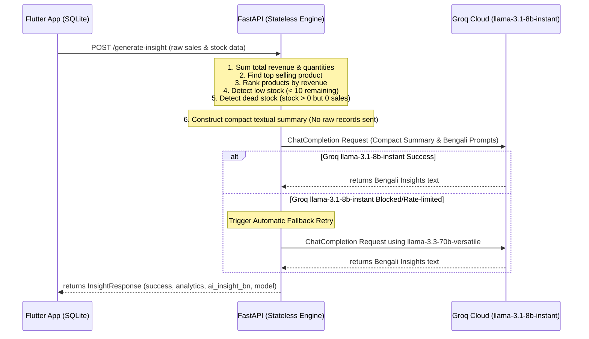

# AI-Powered Shop Insight System: Full Code Flow & Implementation Guide

This document provides a comprehensive walkthrough of the AI-Powered Shop Insight System backend. The system acts as a stateless, high-performance retail analytics engine that computes business metrics locally in Python and leverages Groq LLM to generate actionable business advice in Bengali.

---

## 🏗️ System Architecture & Data Flow

The backend is entirely stateless and does not utilize any database. Data flows from the Flutter application (using local SQLite storage) to the FastAPI backend, which processes the calculations and requests insights from the Groq inference engine.



---

## 🧮 Retail Metric Calculations (Performed in Python)

To minimize token usage, increase performance, and preserve user privacy, raw transactional sales lists are never sent directly to the AI model. Instead, calculations are computed locally in Python:

1. **Total Revenue**: Sum of `revenue` for all records in the `sales` array.
   $$\text{Total Revenue} = \sum \text{item.revenue}$$
2. **Total Quantity**: Sum of `qty` for all records in the `sales` array.
3. **Top Selling Product**: The product that has the highest aggregated quantity (`qty`) in the sales list.
4. **Product Ranking**: Products sorted in descending order of their total sales revenue.
5. **Low Stock Detection**: Filtered list of products from the `stock` array where `remaining < 10`.
6. **Dead Stock Detection**: Filtered list of products that have inventory remaining (`remaining > 0` in the stock array) but have generated zero revenue (`revenue == 0` or absent in the sales list) during the period.

---

## 📂 Complete File Implementations

Here is the complete source code for each of the active components in the system:

### 1. Configurations: `app/core/config.py`
Loads settings from the `.env` file using Pydantic Settings.

```python
from typing import List
from pydantic_settings import BaseSettings, SettingsConfigDict


class Settings(BaseSettings):
    # FastAPI Application Settings
    PROJECT_NAME: str = "FastAPI Groq Base"
    DEBUG: bool = True
    API_V1_STR: str = "/api/v1"
    
    # Groq API Configuration
    GROQ_API_KEY: str
    GROQ_MODEL: str = "llama-3.3-70b-versatile"
    
    # CORS Configuration
    BACKEND_CORS_ORIGINS: List[str] = ["*"]

    # Configure Pydantic Settings behavior
    model_config = SettingsConfigDict(
        env_file=".env",
        env_file_encoding="utf-8",
        case_sensitive=True,
        extra="ignore"
    )


settings = Settings()
```

---

### 2. Request & Response Schemas: `app/schemas/insight.py`
Defines validation schemas using Pydantic V2.

```python
from typing import List
from pydantic import BaseModel, Field


class SalesItem(BaseModel):
    product: str = Field(..., description="Name of the product")
    qty: float = Field(..., description="Quantity of the product sold")
    revenue: float = Field(..., description="Total revenue generated by the product")


class StockItem(BaseModel):
    product: str = Field(..., description="Name of the product")
    remaining: float = Field(..., description="Remaining quantity in stock")


class InsightRequest(BaseModel):
    shop_name: str = Field(..., description="Name of the shop")
    period: str = Field(..., description="Sales and stock time period, e.g., 'last_30_days'")
    sales: List[SalesItem] = Field(..., description="List of products sold and their sales figures")
    stock: List[StockItem] = Field(..., description="List of products and their current stock levels")


class AnalyticsSummary(BaseModel):
    total_revenue: float = Field(..., description="Total revenue generated across all products")
    top_product: str = Field(..., description="Name of the top-selling product by quantity sold")
    low_stock: List[str] = Field(..., description="List of product names with stock level below 10 units")


class InsightResponse(BaseModel):
    success: bool = Field(..., description="Status of the API request")
    analytics: AnalyticsSummary = Field(..., description="Python-computed business analytics summary")
    ai_insight_bn: str = Field(..., description="AI-generated business insights in Bengali")
    model: str = Field(..., description="Name of the LLM model utilized for insights")
```

---

### 3. Groq Service Wrapper: `app/services/groq_client.py`
Encapsulates communication with Groq using `AsyncGroq`.

```python
from typing import List, Dict, Optional, Tuple, Any
from groq import AsyncGroq
import logging

from app.core.config import settings

logger = logging.getLogger(__name__)


class GroqService:
    def __init__(self) -> None:
        # Initialize Groq client with built-in exponential backoff retries (up to 5)
        self.client = AsyncGroq(api_key=settings.GROQ_API_KEY, max_retries=5)
        self.model = settings.GROQ_MODEL

    async def generate_chat_completion(
        self,
        messages: List[Dict[str, str]],
        temperature: float = 0.7,
        max_tokens: Optional[int] = None,
        model: Optional[str] = None
    ) -> Tuple[str, Optional[Dict[str, int]]]:
        try:
            target_model = model or self.model
            logger.debug(f"Calling Groq API. Model: '{target_model}', Messages count: {len(messages)}")
            
            completion = await self.client.chat.completions.create(
                messages=messages,  # type: ignore
                model=target_model,
                temperature=temperature,
                max_tokens=max_tokens
            )
            
            result = completion.choices[0].message.content or ""
            
            usage = None
            if completion.usage:
                usage = {
                    "prompt_tokens": completion.usage.prompt_tokens,
                    "completion_tokens": completion.usage.completion_tokens,
                    "total_tokens": completion.usage.total_tokens
                }
            
            logger.debug(f"Successfully fetched response from Groq. Token Usage: {usage}")
            return result, usage
            
        except Exception as e:
            logger.error(f"Error in Groq API request flow: {str(e)}")
            raise e


groq_service = GroqService()
```

---

### 4. Insight Endpoint Logic: `app/api/v1/endpoints/insight.py`
Executes calculations, builds prompts, and manages the Groq automatic model fallback mechanism.

```python
import logging
from fastapi import APIRouter, HTTPException, status

from app.core.config import settings
from app.schemas.insight import InsightRequest, InsightResponse, AnalyticsSummary
from app.services.groq_client import groq_service

logger = logging.getLogger(__name__)
router = APIRouter()


@router.post(
    "/generate-insight",
    response_model=InsightResponse,
    status_code=status.HTTP_200_OK,
    summary="Generate Shop Business Insights"
)
async def generate_insight(request: InsightRequest) -> InsightResponse:
    try:
        logger.info(f"Processing insight request for shop: '{request.shop_name}'")

        # 1. Aggregating Sales Data (handling duplicates if any)
        product_sales_revenue = {}
        product_sales_qty = {}
        for item in request.sales:
            p = item.product
            product_sales_revenue[p] = product_sales_revenue.get(p, 0.0) + item.revenue
            product_sales_qty[p] = product_sales_qty.get(p, 0.0) + item.qty

        total_revenue = sum(item.revenue for item in request.sales)

        # 2. Identify top product by quantity sold
        if product_sales_qty:
            top_product = max(product_sales_qty, key=lambda k: product_sales_qty[k])
        else:
            top_product = "None"

        # 3. Rank top 5 products by revenue for prompt enrichment
        sorted_by_revenue = sorted(product_sales_revenue.items(), key=lambda x: x[1], reverse=True)
        revenue_ranking_str = ", ".join([f"{p} (৳{r:.2f})" for p, r in sorted_by_revenue[:5]])

        # 4. Group stocks & detect low stock (< 10 remaining)
        product_stock_levels = {}
        for item in request.stock:
            p = item.product
            product_stock_levels[p] = product_stock_levels.get(p, 0.0) + item.remaining

        low_stock_products = [p for p, rem in product_stock_levels.items() if rem < 10]

        # 5. Dead stock detection (stock > 0 but revenue == 0 during the period)
        dead_stock_products = []
        for p, rem in product_stock_levels.items():
            if rem > 0 and product_sales_revenue.get(p, 0.0) == 0.0:
                dead_stock_products.append(p)

        # 6. Structuring prompt content
        low_stock_str = ", ".join(low_stock_products) if low_stock_products else "None"
        dead_stock_str = ", ".join(dead_stock_products) if dead_stock_products else "None"

        system_instruction = (
            "You are a professional, friendly, and expert retail consultant speaking fluent Bengali. "
            "Your objective is to provide a brief, high-value, and actionable business report for a shopkeeper. "
            "You must write exclusively in Bengali (বাংলা). Do not translate the business metrics names into english characters, "
            "but present your recommendations, trend predictions, and stock suggestions clearly. "
            "Keep the output clean and structure it into four distinct sections:\n"
            "1. ব্যবসার অবস্থা বিশ্লেষণ (Business Insights)\n"
            "2. ইনভেন্টরি বা স্টক উন্নত করার পরামর্শ (Stock Suggestions)\n"
            "3. ভবিষ্যৎ বিক্রয়ের গতিধারা বা ট্রেন্ড (Future Trends)\n"
            "4. দোকানদারের জন্য সরাসরি পালনযোগ্য পরামর্শ (Actionable Advice)"
        )

        user_content = (
            f"দোকানের নাম (Shop Name): {request.shop_name}\n"
            f"সময়কাল (Period): {request.period}\n"
            f"মোট রাজস্ব (Total Revenue): ৳{total_revenue:.2f}\n"
            f"সবচেয়ে বেশি বিক্রি হওয়া পণ্য (Top Selling Product): {top_product}\n"
            f"রাজস্ব অনুযায়ী শীর্ষ পণ্যসমূহ: {revenue_ranking_str if revenue_ranking_str else 'None'}\n"
            f"কম স্টক থাকা পণ্য (< 10 units): {low_stock_str}\n"
            f"অচল বা অবিক্রীত স্টক (has inventory but 0 sales): {dead_stock_str}\n\n"
            "অনুগ্রহ করে উপরোক্ত তথ্য বিশ্লেষণ করে নিম্নলিখিত বিষয়গুলো বাংলায় প্রদান করুন:\n"
            "- ব্যবসার সার্বিক অবস্থার বিশ্লেষণ (Bengali business insights)\n"
            "- স্টক বা ইনভেন্টরি উন্নত করার পরামর্শ (Stock improvement suggestions)\n"
            "- ভবিষ্যৎ বিক্রয়ের ট্রেন্ড বা গতিধারার পূর্বাভাস (Predict future sales trend)\n"
            "- দোকানদারের জন্য সরাসরি পালনযোগ্য ও বাস্তবসম্মত পরামর্শ (Actionable advice for shopkeeper)"
        )

        messages = [
            {"role": "system", "content": system_instruction},
            {"role": "user", "content": user_content}
        ]

        # 7. Request insights with fallback safety
        model_name = "llama-3.1-8b-instant"
        try:
            ai_insight_text, _ = await groq_service.generate_chat_completion(
                messages=messages,
                temperature=0.7,
                model=model_name
            )
        except Exception as api_err:
            logger.warning(
                f"Failed to generate insight using model {model_name}. "
                f"Attempting fallback to default '{settings.GROQ_MODEL}'... Error: {api_err}"
            )
            model_name = settings.GROQ_MODEL
            ai_insight_text, _ = await groq_service.generate_chat_completion(
                messages=messages,
                temperature=0.7,
                model=model_name
            )

        # 8. Return response
        analytics_summary = AnalyticsSummary(
            total_revenue=total_revenue,
            top_product=top_product,
            low_stock=low_stock_products
        )

        return InsightResponse(
            success=True,
            analytics=analytics_summary,
            ai_insight_bn=ai_insight_text,
            model=model_name
        )

    except Exception as e:
        logger.error(f"Failed to generate shop insights: {str(e)}", exc_info=True)
        raise HTTPException(
            status_code=status.HTTP_500_INTERNAL_SERVER_ERROR,
            detail=f"Internal Server Error: {str(e)}"
        )
```

---

### 5. API Router: `app/api/v1/api.py`
Includes versioned routers.

```python
from fastapi import APIRouter
from app.api.v1.endpoints import insight

api_router = APIRouter()

api_router.include_router(
    insight.router,
    tags=["Shop Insights"]
)
```

---

### 6. App Entrypoint: `app/main.py`
Main application that configures CORS, initializes components, and mounts routes.

```python
import logging
from contextlib import asynccontextmanager
from fastapi import FastAPI
from fastapi.middleware.cors import CORSMiddleware

from app.core.config import settings
from app.core.logger import setup_logging
from app.api.v1.api import api_router
from app.api.v1.endpoints.insight import router as insight_router

logger = logging.getLogger(__name__)


@asynccontextmanager
async def lifespan(app: FastAPI):
    setup_logging()
    logger.info("Initializing FastAPI Application base...")
    
    if not settings.GROQ_API_KEY:
        logger.warning(
            "CRITICAL WARNING: GROQ_API_KEY environment variable is not defined. "
            "Calls to /generate-insight will fail to generate AI insights."
        )
    else:
        logger.info("Groq API client credentials validated.")

    yield
    logger.info("Application is shutting down. Cleaning up connections...")


app = FastAPI(
    title=settings.PROJECT_NAME,
    description="Production-grade FastAPI Shop Insights Engine",
    version="1.0.0",
    openapi_url=f"{settings.API_V1_STR}/openapi.json",
    lifespan=lifespan
)

# Configure Cross-Origin Resource Sharing (CORS) Middleware
if settings.BACKEND_CORS_ORIGINS:
    app.add_middleware(
        CORSMiddleware,
        allow_origins=[str(origin) for origin in settings.BACKEND_CORS_ORIGINS],
        allow_credentials=True,
        allow_methods=["*"],
        allow_headers=["*"],
    )

# Include the routers (Exposing both Root and Versioned paths)
app.include_router(api_router, prefix=settings.API_V1_STR)
app.include_router(insight_router, tags=["Shop Insights"])


@app.get("/", tags=["App Health Status"])
async def health_check() -> dict:
    return {
        "status": "operational",
        "project": settings.PROJECT_NAME,
        "documentation": "/docs",
        "api_prefix": settings.API_V1_STR
    }
```

---

## 🚀 How to Run and Test

1. **Activate Virtual Environment**:
   ```bash
   source .venv/bin/env/activate  # or run directly using python path:
   # ./.venv/bin/python
   ```
2. **Start the FastAPI Server**:
   ```bash
   uvicorn app.main:app --reload
   ```
3. **Execute Test Script**:
   ```bash
   ./.venv/bin/python test_insight.py
   ```
4. **Access API Documentation**:
   Visit [http://127.0.0.1:8000/docs](http://127.0.0.1:8000/docs) in your browser to inspect or test endpoints interactively.
